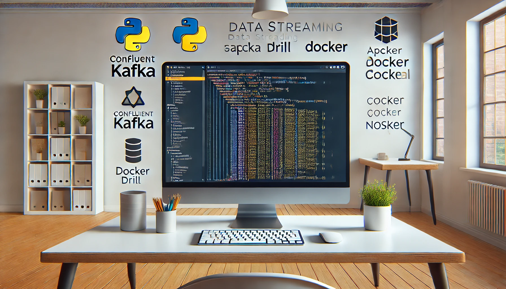

<h2 align="center">
  PySpark + Optimus, Confluent Kafka, Apache Drill, Cassandra/NoSQL + Docker Code Demo<br/>
</h2>
<div align="center">
  
</div>
<br/>
<center>
</center>
# PySpark + Optimus, Confluent Kafka, Apache Drill, Cassandra/NoSQL + Docker Code Example

A code-based tutorial on setting up production-grade data streams with PySpark, Optimus, Confluent Kafka, and Drill using Docker, with Cassandra (NoSQL) as storage.

**Author**: Max (Leiwen) Lin  
**GitHub URL**: [data_streaming_pyspark](https://github.com/linleiwen/data_streaming_pyspark)

## Table of Contents
- [PySpark + Optimus, Confluent Kafka, Apache Drill, Cassandra/NoSQL + Docker Code Example](#pyspark--optimus-confluent-kafka-apache-drill-cassandranosql--docker-code-example)
  - [Table of Contents](#table-of-contents)
  - [Introduction](#introduction)
  - [Technologies Used](#technologies-used)
  - [Architecture Overview](#architecture-overview)
  - [Setup and Installation](#setup-and-installation)
    - [Docker Setup](#docker-setup)
    - [Setting Up PySpark and Optimus](#setting-up-pyspark-and-optimus)
    - [Configuring Confluent Kafka](#configuring-confluent-kafka)
    - [Integrating Apache Drill](#integrating-apache-drill)
    - [Using Cassandra for NoSQL Storage](#using-cassandra-for-nosql-storage)
  - [Running the Example](#running-the-example)
  - [Detailed Code Walkthrough](#detailed-code-walkthrough)
    - [PySpark and Optimus](#pyspark-and-optimus)
    - [Confluent Kafka](#confluent-kafka)
    - [Apache Drill](#apache-drill)
    - [Cassandra](#cassandra)
  - [Conclusion](#conclusion)

## Introduction
This tutorial provides a comprehensive guide to setting up a production-grade data streaming pipeline using a combination of PySpark, Optimus, Confluent Kafka, Apache Drill, and Cassandra. We will use Docker to simplify the deployment process and ensure that each component is easily configurable and scalable.

## Technologies Used
- **PySpark**: A Python API for Spark.
- **Optimus**: An efficient, scalable, and easy-to-use Data Preparation, Exploration, and Analysis library.
- **Confluent Kafka**: A distributed streaming platform.
- **Apache Drill**: A schema-free SQL query engine for Hadoop, NoSQL, and cloud storage.
- **Cassandra**: A highly scalable NoSQL database system.
- **Docker**: A platform for developing, shipping, and running applications in containers.

## Architecture Overview
The architecture consists of several interconnected components:
1. **PySpark and Optimus**: Used for data processing and transformation.
2. **Confluent Kafka**: Serves as the data streaming platform.
3. **Apache Drill**: Provides the capability to run SQL queries on various data sources.
4. **Cassandra**: Acts as the NoSQL database for data storage.
5. **Docker**: Used to containerize each component, ensuring consistency and ease of deployment.


## Setup and Installation

### Docker Setup
First, ensure that Docker is installed on your system. You can download Docker from [here](https://www.docker.com/products/docker-desktop).

Clone the repository:
\```bash
git clone https://github.com/linleiwen/pyspark-optimus-kafka-drill-cassandra-docker.git
cd pyspark-optimus-kafka-drill-cassandra-docker
\```

### Setting Up PySpark and Optimus
We will use Docker to set up PySpark and Optimus.

\```bash
docker-compose up -d pyspark
\```

### Configuring Confluent Kafka
Set up Confluent Kafka using Docker Compose:

\```bash
docker-compose up -d kafka
\```

### Integrating Apache Drill
Set up Apache Drill with Docker:

\```bash
docker-compose up -d drill
\```

### Using Cassandra for NoSQL Storage
Set up Cassandra using Docker:

\```bash
docker-compose up -d cassandra
\```

## Running the Example
Once all the services are up and running, execute the following command to start the data pipeline:

\```bash
docker-compose up
\```

## Detailed Code Walkthrough
Each component's code and configuration are located in their respective directories. Below is a brief overview of the setup:

### PySpark and Optimus
- Configuration and initialization scripts.
- Sample data processing scripts.

### Confluent Kafka
- Kafka broker and Zookeeper configuration.
- Sample producer and consumer scripts.

### Apache Drill
- Drill configuration files.
- Sample SQL queries for data exploration.

### Cassandra
- Keyspace and table creation scripts.
- Sample data insertion and query scripts.

## Conclusion
This tutorial demonstrated how to set up a production-grade data streaming pipeline using PySpark, Optimus, Confluent Kafka, Apache Drill, and Cassandra, all managed through Docker. This setup ensures scalability, flexibility, and ease of deployment for real-world data processing tasks.

For more details and to access the complete code, visit my [GitHub repository](https://github.com/linleiwen/pyspark-optimus-kafka-drill-cassandra-docker).
